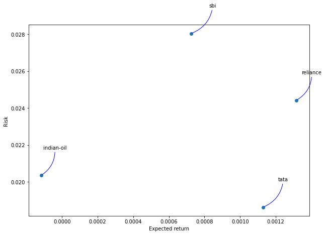
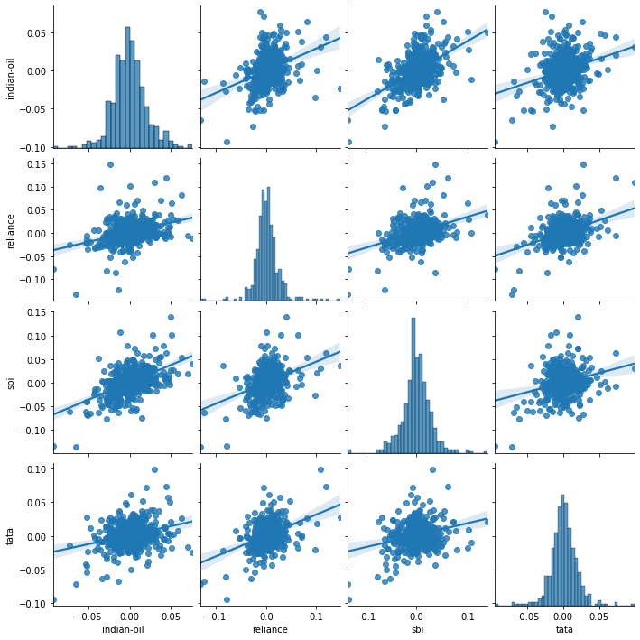
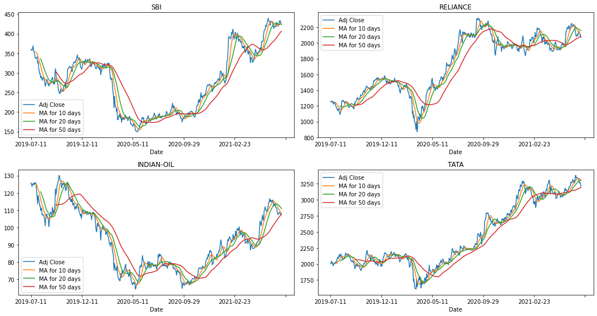
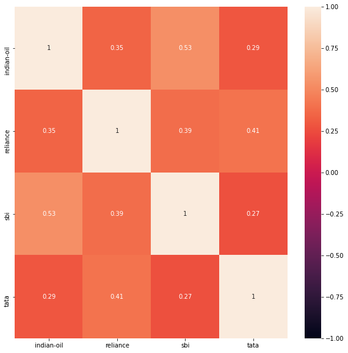
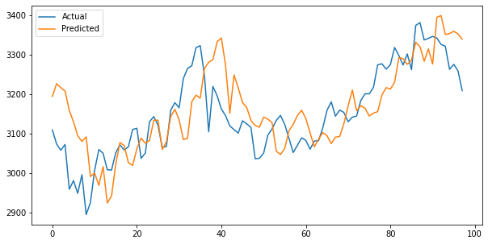
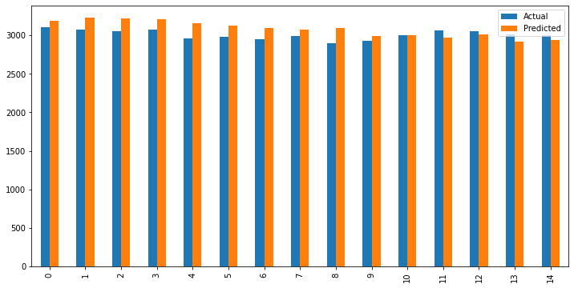
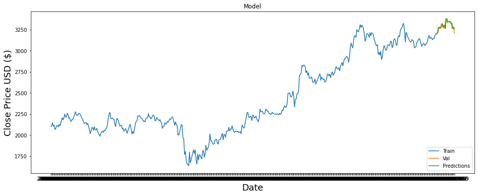
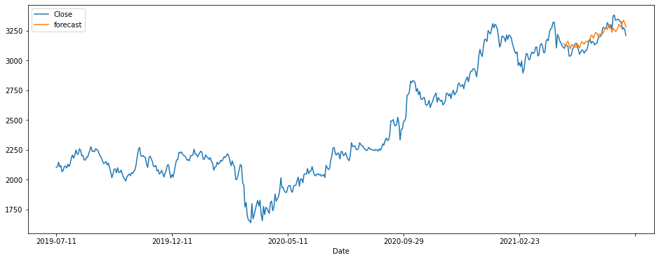
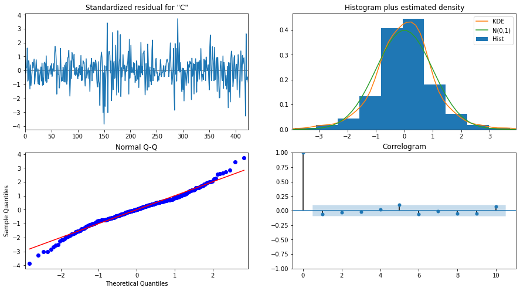

# Stock-Prediction
A stock market prediction is an attempt to forecast the future value of an individual stock, a particular sector or the market, or the market as a whole. These forecasts generally use fundamental analysis of a company or economy, or technical analysis of charts, or a combination of the two.

## About the Project
In this project we performed stock trend analysis on 4 different companies <b>State Bank of India (SBI), Indian Oil, Tata Consultancy Services (TCS) and Reliance</b>.
Trends such as <b>Moving Average, Daily returns, Correlation among daily returns percentage change and Risk involved against expected return</b> were compared using different types of graphs. 
The models used were <b>Linear Regression,SARIMAX and LSTM</b>.

## Data Visualization
Various graphs have been plotted such as the moving average, correlation of adjusted closing prices and risk involved against expected return.
 
     
    
  
  ## Prediction using Linear Regression
  The columns 'Open','Close' and 'Volume' have been used to predict the closing price of <b>TCS</b>. Data was split into 80 train and test data with train data equal to 80% of the dataset.
  <body>
    <table align="center">
        <tr>
            <th>Actual </th>
            <th>Predicted</th>
        </tr>
        <tr>
            <td>3108.800049
            </td>
            <td>3193.657628</td>
        </tr>
        <tr>
            <td>3073.100098</td>
            <td>3226.023985</td>
        </tr>
        <tr>
            <td>3057.350098</td>
            <td>3215.909687</td>
        </tr>
        <tr>
            <td>3071.850098</td>
            <td>3207.167217</td>
        </tr>
      <tr>
            <td>2958.449951</td>
            <td>3158.323517</td>
        </tr>
    </table>
</body>

   

Linear Regression has a <b>r2_score of 0.40</b> and a low score was expected as the model assumes the mean and variance to be constant over time however clearly thats not the case here.

 ## Prediction using LSTM
 Two LSTM and two Dense layers were used and <b>RMSE of 35.30</b> was achieved. MinMaxScaler was used to reduce all values in 'Closing Price' between 0 and 1. Predictions were made based on the closing price of the previous 60 days.
 
 
  ## Prediction using SARIMAX
  Auto_arima was used to find the best parameters for the model by minimizing the <b>AIC(Akaike's Information Criterion)</b>. The model achieved an <b>r2_score of 0.679</b>
  and <b>RMSE of 56.06</b>.
  
   
   
  
 
